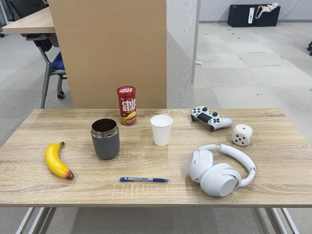
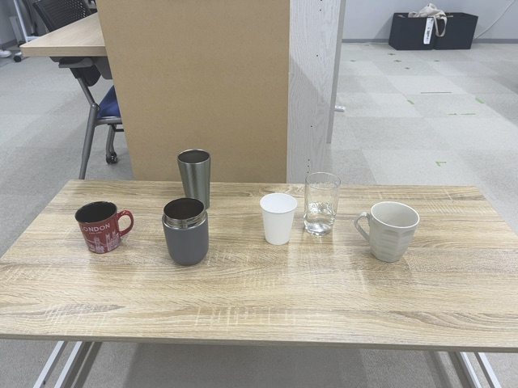
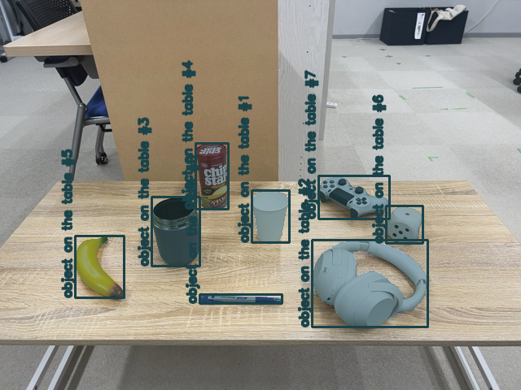
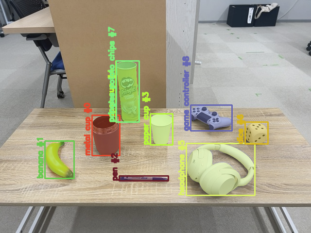
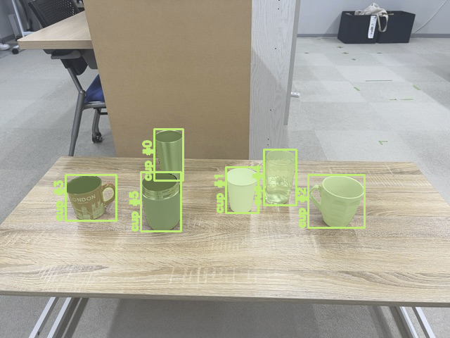

<a name="readme-top"></a>

[EN](README.md) | [JA](README_ja.md)

[![Contributors][contributors-shield]][contributors-url]
[![Forks][forks-shield]][forks-url]
[![Stargazers][stars-shield]][stars-url]
[![Issues][issues-shield]][issues-url]
[![License][license-shield]][license-url]

# SAM3 ROS

<details>
  <summary>目次</summary>
  <ol>
    <li>
      <a href="#概要">概要</a>
    </li>
    <li>
      <a href="#セットアップ">セットアップ</a>
      <ul>
        <li><a href="#環境条件">環境条件</a></li>
        <li><a href="#インストール方法">インストール方法</a></li>
        <li><a href="#SAM-3-ウェイトファイルのダウンロード">SAM 3 ウェイトファイルのダウンロード</a></li>
      </ul>
    </li>
    <li><a href="#実行操作方法">実行・操作方法</a></li>
    <li><a href="#パラメーター">パラメーター</a></li>
    <li><a href="#デモ">デモ</a></li>
     <!-- <li><a href="#マイルストーン">マイルストーン</a></li> -->
    <li><a href="#参考文献">参考文献</a></li>
  </ol>
</details>

## 概要
sam3_ros は，Meta が公開した Segment Anything Model 3 (SAM3) を ROS 2で利用するためのラッパーパッケージです．

本パッケージでは **テキストプロンプトに基づくクラス指定セグメンテーション** を行い，以下の機能がROS2環境で実現できます．

- テキスト指示による物体セグメンテーション
- マルチクラス・マルチインスタンス対応
- バウンディングボックス (Detection2D)
- セグメンテーションマスク付き検出 (Detection2DWithMask)
- 可視化済み画像出力

<p align="right">(<a href="#readme-top">上に戻る</a>)</p>


## セットアップ
本レポジトリのセットアップ方法について説明します．

<p align="right">(<a href="#readme-top">上に戻る</a>)</p>


### 環境条件

| System  | Version |
| ------------- | ------------- |
| Ubuntu | 22.04 (Jammy Jellyfish) |
| ROS | Humble Hawksbill |
| Python | 3.0~ |

### インストール方法
1. ROS2の`src`フォルダに移動します．
   ```sh
   cd　~/colcon_ws/src/
   ```
2. 本レポジトリをcloneします．
   ```sh
   git clone -b humble-devel https://github.com/TeamSOBITS/sam3_ros.git
   ```
3. レポジトリの中へ移動します．
   ```sh
   cd sam3_ros
   ```
4. 依存パッケージをインストールします．
    ```sh
    bash install.sh
    ```
5. パッケージをコンパイルします．
   ```sh
   cd ~/colcon_ws/
   colcon build --symlink-install
   ```
> [!NOTE]
> 2026年3月2日時点において本パッケージを使用するにはsobits_interfaceのブランチをfeature/segmentationへ変更する必要があります. 現在はmainにmargeされている可能性もあるため確認してください.
<p align="right">(<a href="#readme-top">上に戻る</a>)</p>


### SAM 3 ウェイトファイルのダウンロード
SAM 3 用の `sam3.pt` と SAM 3.1 用の `sam3.1_multiplex.pt` の2種類のチェックポイントを使用できます．

SAM 3 の重みファイルはライセンスの都合上，自動ではダウンロードされません．  
使用するチェックポイントを**事前に手動でダウンロードしてください**．

1. Hugging Face 上の [**SAM 3 モデルページ**](https://huggingface.co/facebook/sam3) または [**SAM 3.1 モデルページ**](https://huggingface.co/facebook/sam3.1) にアクセスし，
   モデルの重みファイルへのアクセスをリクエストしてください．

2. 承認後，[`sam3.pt`](https://huggingface.co/facebook/sam3/resolve/main/sam3.pt?download=true) または [`sam3.1_multiplex.pt`](https://huggingface.co/facebook/sam3.1/resolve/main/sam3.1_multiplex.pt?download=true) をダウンロードします．

3. ダウンロードしたチェックポイント（`sam3.pt` または `sam3.1_multiplex.pt`）を以下のディレクトリに配置してください．
   - ウェイトディレクトリ（[`sam3_ros/weights`](https://github.com/TeamSOBITS/sam3_ros/blob/humble-devel/weights)）

<p align="right">(<a href="#readme-top">上に戻る</a>)</p>


## 実行・操作方法
1. カメラを起動し，[sam3.launch.py](https://github.com/TeamSOBITS/sam3_ros/blob/humble-devel/launch/sam3.launch.py)の**image_topic_name**を使用するカメラのトピック名に書き換える．
   
   例
   ```sh
   default_value="/camera/color/image_raw"             # orbbec_series
   ```
2. RGBDカメラを使用する場合は，[sam3.launch.py](https://github.com/TeamSOBITS/sam3_ros/blob/humble-devel/launch/sam3.launch.py)の**point_cloud_topic**も使用するカメラの点群のトピック名に書き換える．
   
   例
   ```sh
   default_value="/camera/depth_registered/points"     # orbbec_series
   ```
3. ウェイトファイルを設定\
    用意したウェイトファイルを[weightsディレクトリ](https://github.com/TeamSOBITS/sam3_ros/blob/humble-devel/weights)に入れる．
4. [sam3.launch.py](https://github.com/TeamSOBITS/sam3_ros/blob/humble-devel/launch/sam3.launch.py)の**weight_file**を，手順3で設定したウェイトファイル名に書き換える．
   ```sh
   default_value=os.path.join(get_package_share_directory("sam3_ros"), "weights", "sam3.pt")  # or "sam3.1_multiplex.pt"
   ```
5. colcon buildを実行
   ```sh
   cd ~/colcon_ws/
   colcon build --symlink-install
   ```
6. SAM 3 を起動
    ```sh
    ros2 launch sam3_ros sam3.launch.py
    ```
   例: 起動時に SAM 3 を Configure のみして Activate しない場合
    ```sh
    ros2 launch sam3_ros sam3.launch.py auto_configure:=True auto_activate:=False
    ```

<p align="right">(<a href="#readme-top">上に戻る</a>)</p>


## パラメーター
以下は[sam3.launch.py](https://github.com/TeamSOBITS/sam3_ros/blob/humble-devel/launch/sam3.launch.py)で設定できるパラメーターである．

| パラメーター名  | 説明 | デフォルト値 |
| ------------- | ------------- | ------------- |
| weight_file               | SAM3 の重みファイル | sam3.pt |
| prompt_text               | セグメンテーション対象クラス（文字列配列） | ["object"] |
| threshold                 | マスク生成の信頼度閾値 | 0.75 |
| half                      | FP16 推論を有効にするか | True |
| image_show                | 推論時に Ultralytics 側の表示を有効化 | False |
| auto_configure            | 起動時に SAM3 ライフサイクルノードを Configure するか | True |
| auto_activate             | 起動時に SAM3 ライフサイクルノードを Activate するか | True |
| execute_default           | 起動時に含まれる 3D ライフサイクルノードを自動で Configure / Activate するか | True |
| use_bbox_to_3d            | `bbox_to_3d` の3D検出パイプラインを起動するか | True |
| use_mask_to_3d            | `mask_to_3d` の3D検出パイプラインを起動するか．`publish_mask` も `True` である必要があります | False |
| cluster_tolerance         | どの程度離れた点群までは同一の物体とみなすかのしきい値．BoundingBox内に点群を飛ばした場合に，対象物に点群があたり，しきい値いないにある点群を1物体とみなしクラス分けを行います． そのため，あまり大きくすると点群1つ1つの探索範囲が広がり処理が遅くなってしまいます． | 0.01 |
| min_clusterSize           | どの程度の数以下の点群の集まりは対象物の点群から棄却するかのしきい値．点群をクラス分けした際に，この数以下の点群数だったらノイズとみなし棄却します． | 100 |
| max_clusterSize           | どの程度の数以上の点群の集まりは対象物の点群から棄却するかのしきい値．点群をクラス分けした際に，この数以上の点群数だったら全く別の対象物(物体だったら床の点群など)を捉えてしまったとみなし棄却します． | 20000 |
| noise_point_cloud_range   | 対象の物体の点群からノイズ面を除去し，中心座標に近づけるため除去量．クラス分けした点群から物体を抽出した後，床や背後の壁，左右の壁などx,y,z方向に点群をこの値分，更にカットします． こうすることで，より物体の部分のみにかかる点群に絞ることができます． しかし値を大きくしすぎると，物体分の点群まで多く削いでしまうため注意が必用です． | 0.01 |
| fast_shot                 | fast_shotを有効にするかどうか | true |
| enable_id                 | 検出した物体のラベルの後ろにIDをつけるかどうか(例: apple_01) | false |

<p align="right">(<a href="#readme-top">上に戻る</a>)</p>


### Publications
| Topic名                                  | 型                        | 説明            |
| --------------------------------------- | ------------------------ | ------------- |
| `/sam3_ros/object_boxes`                | Detection2DArray         | バウンディングボックスのみ |
| `/sam3_ros/object_detections_with_mask` | Detection2DWithMaskArray | マスク付き検出結果     |
| `/sam3_ros/segmented_image`             | sensor_msgs/Image        | 可視化画像         |

<p align="right">(<a href="#readme-top">上に戻る</a>)</p>


## デモ
| 物体検出 | 物体認識 | インスタンスセグメンテーション |
|:---:|:---:|:---:|
|  |  |  |
|  |  |  |

<p align="right">(<a href="#readme-top">上に戻る</a>)</p>


## 参考文献
* [SAM 3: Segment Anything with Concepts](https://github.com/facebookresearch/sam3)
* [Ultralytics ドキュメント](https://docs.ultralytics.com/ja/models/sam-3/)

[contributors-shield]: https://img.shields.io/github/contributors/TeamSOBITS/sam3_ros.svg?style=for-the-badge
[contributors-url]: https://github.com/TeamSOBITS/sam3_ros/graphs/contributors
[forks-shield]: https://img.shields.io/github/forks/TeamSOBITS/sam3_ros.svg?style=for-the-badge
[forks-url]: https://github.com/TeamSOBITS/sam3_ros/network/members
[stars-shield]: https://img.shields.io/github/stars/TeamSOBITS/sam3_ros.svg?style=for-the-badge
[stars-url]: https://github.com/TeamSOBITS/sam3_ros/stargazers
[issues-shield]: https://img.shields.io/github/issues/TeamSOBITS/sam3_ros.svg?style=for-the-badge
[issues-url]: https://github.com/TeamSOBITS/sam3_ros/issues
[license-shield]: https://img.shields.io/github/license/TeamSOBITS/sam3_ros.svg?style=for-the-badge
[license-url]: LICENSE
